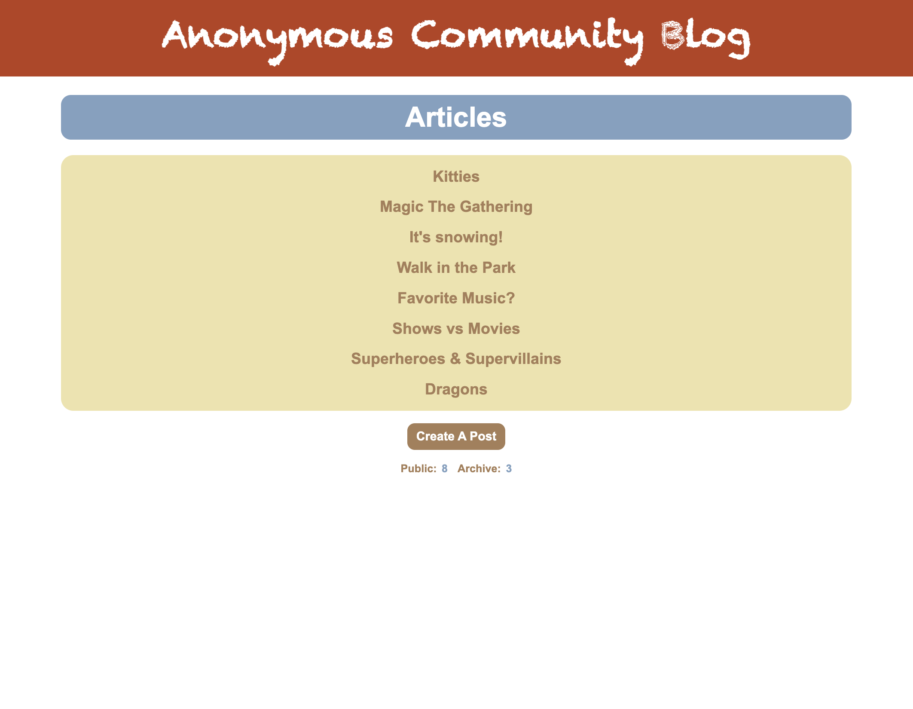
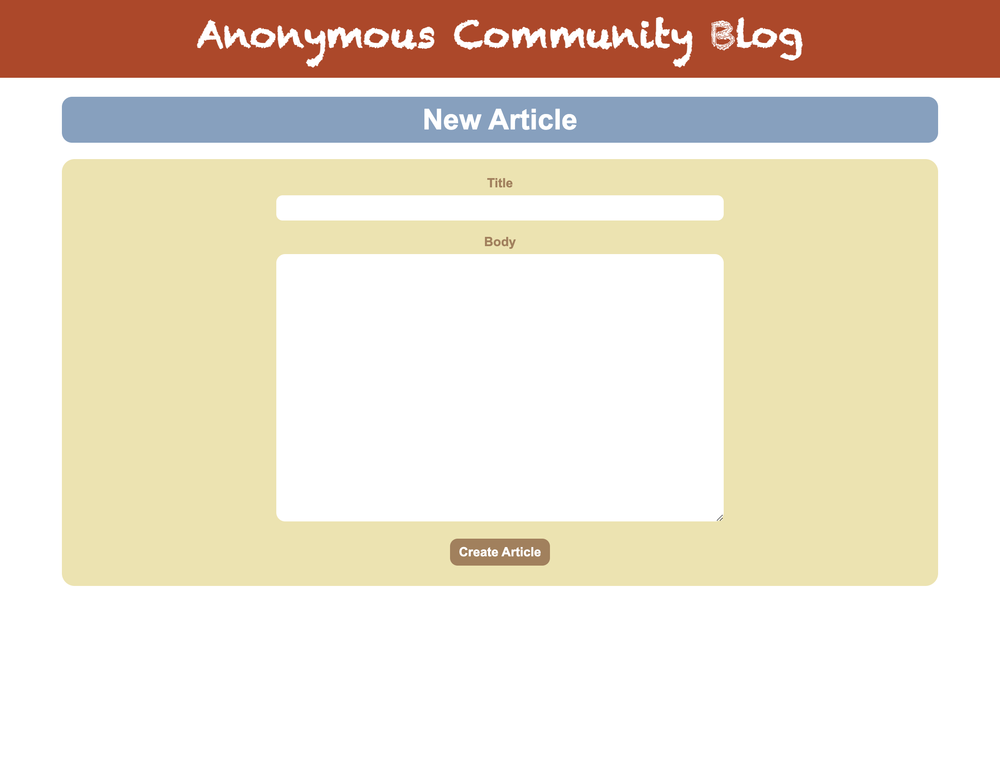
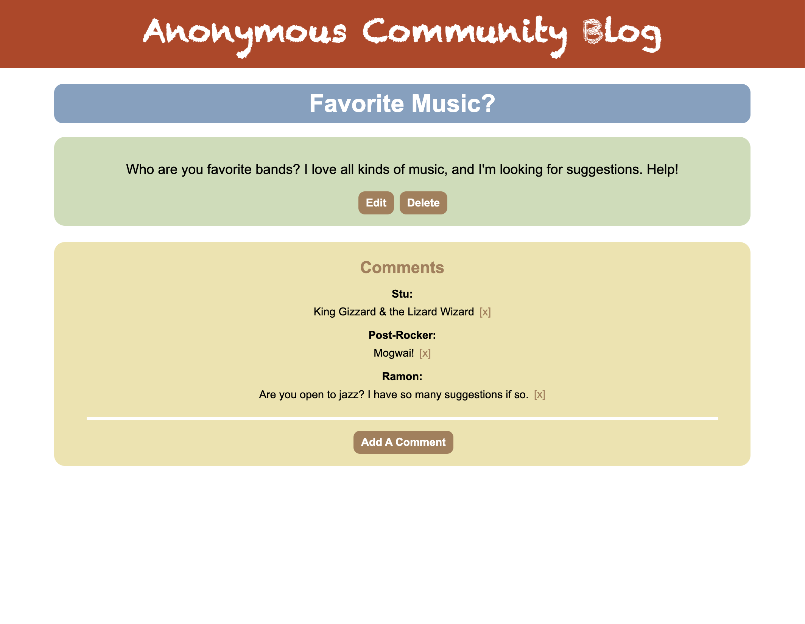
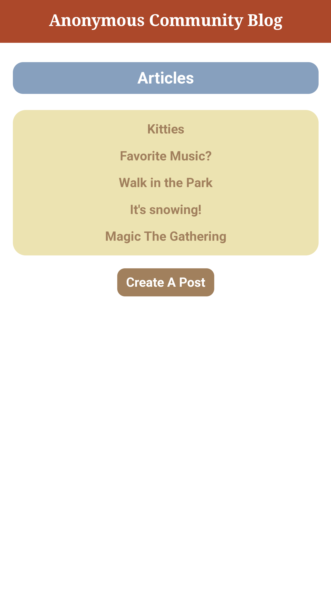
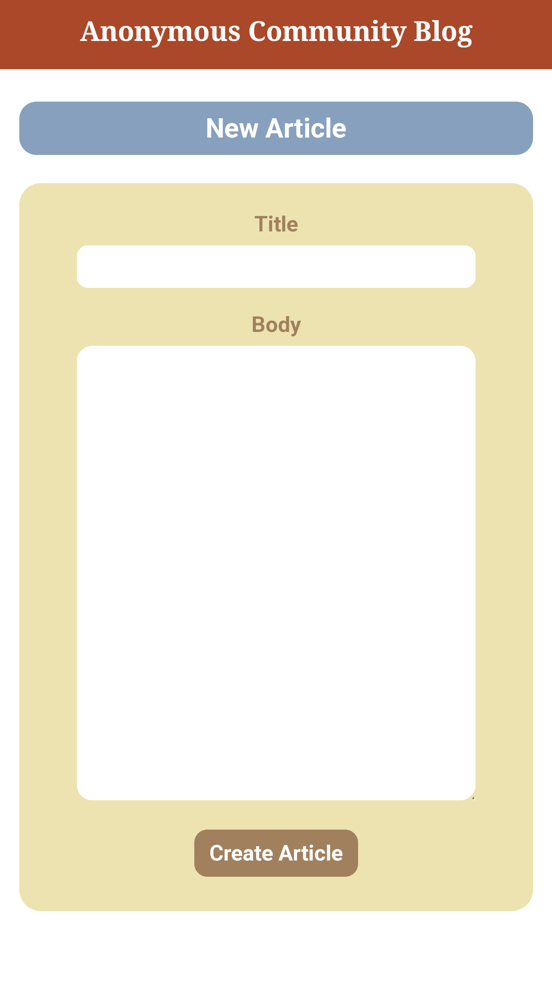
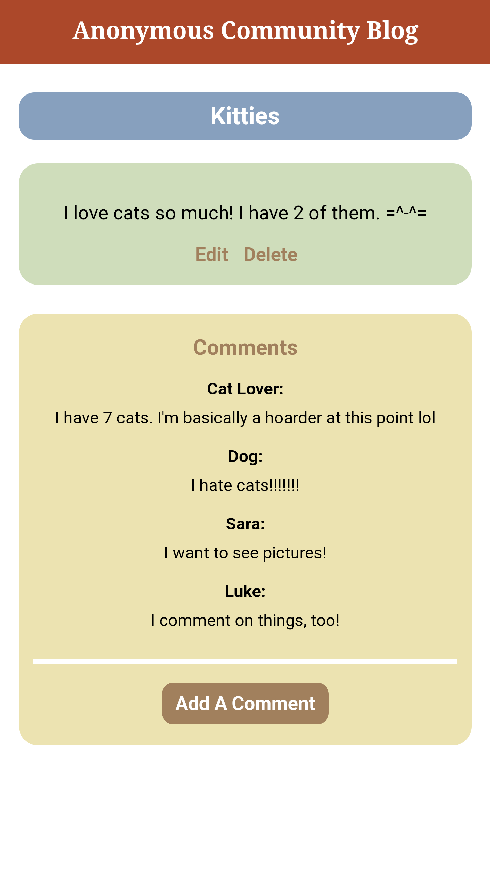

# Anonymous Community Blog

Anonymous Community Blog is an interactive, conceptual art experiment, where anyone online can create, edit, and delete blog posts, as well as leave comments.

[It can be accessed here.](https://rails-fun.herokuapp.com/)

## Motivation

This was my first rails application, so the skeleton was created from the official Rails guide called ["Getting Started with Rails"](https://guides.rubyonrails.org/getting_started.html), and then the idea took off from there.

## Languages and technology

Utilizes Ruby, Rails, CSS, HTML, NPM, Node, & Heroku

Built with Visual Studio Code

[Code stored on GitHub](https://github.com/hayleyskyland/rails_fun)

## Access and use website

Visit the site [here](https://rails-fun.herokuapp.com/).

The user will be presented a list of existing blog post titles.

If they click on an title, they are directed to that post's page, where they can read, edit, or delete it, or they can read or add comments.

If they click the "Create A Post" button, they are provided a form to create their own article.

While back and forward browser buttons work, to quickly return home at any time, the user can also simply click the the website title in the header.

## Screenshots

### Desktop

  
  
  

### Mobile

  
  
  

## Future additions

* I will implement edit & deletion for comments.

* I will add an "undo" button.

## Contributors

Project completed by [Hayley Witherell](https://github.com/hayleyw7)
